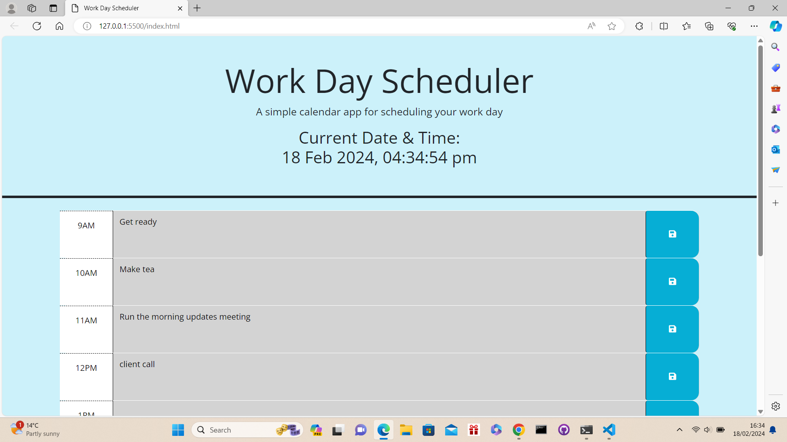

# 5th-Challenge-Work-Day-Schedule

## What was my target and what have i achieved?

In this project I was tasked with creating a fully functioning work schedule which I have successfully been able to achieve by ensuring that when the page in loaded the user is greeted with the time and date at the top of the page. In addition I have also made sure that the user has the timeslots from 9am to 5pm.

Furthermore, I have also made sure that when the user is actively using the webpage that it is constantly updating to show the past,present and future via a color coded system. Finally I have also ensured that the user is able to save their entries to the local storage and that when the page is resfreshed their entered data is still visible.

